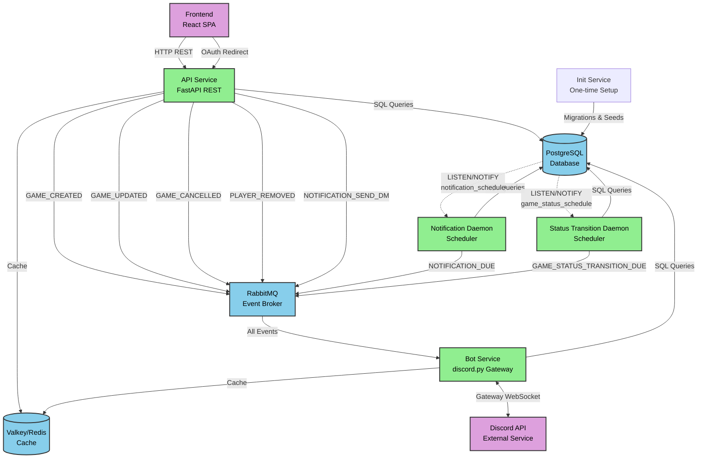
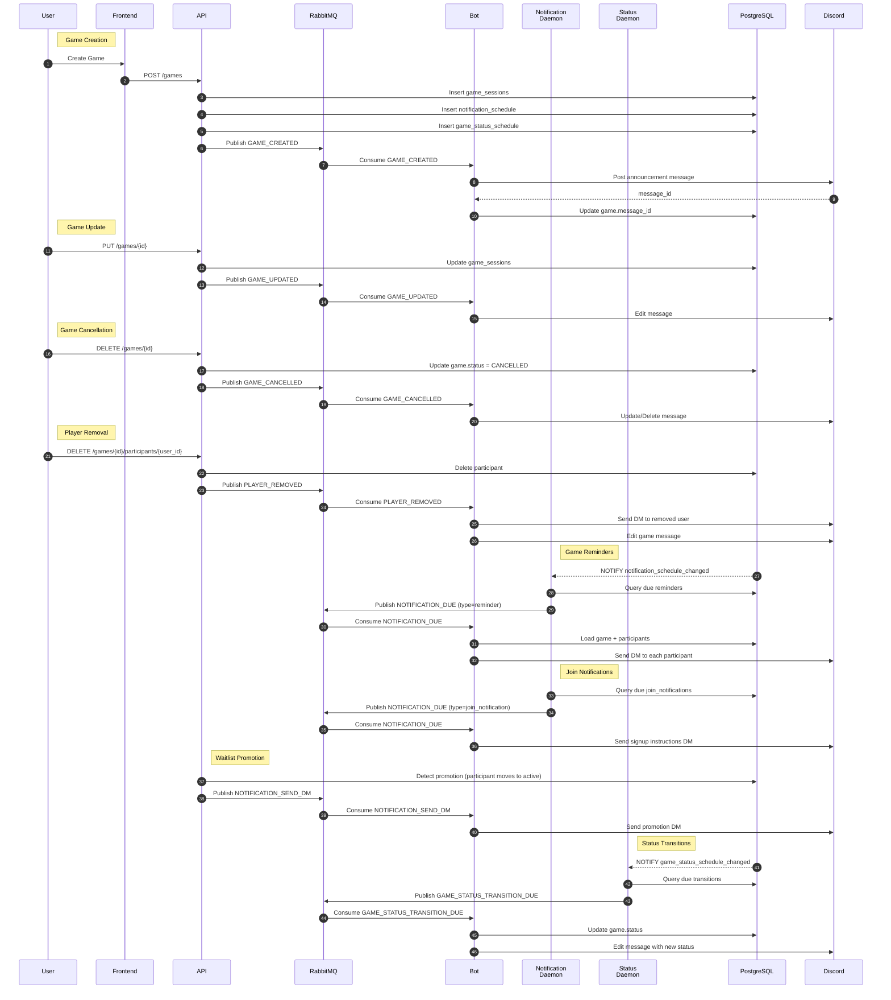
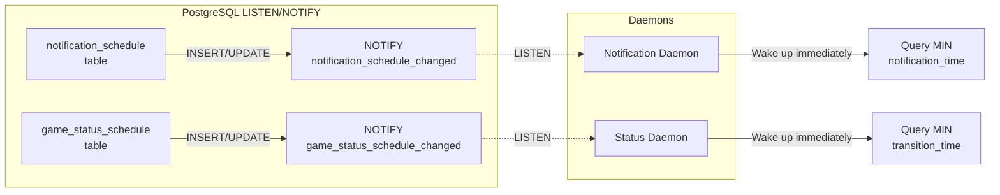

# System Architecture

This document describes the microservices architecture of the Game Scheduler system, including service communication patterns, event flows, and database-driven scheduling.

## Overview

Game Scheduler uses a microservices architecture with event-driven communication through RabbitMQ and database-backed scheduling with PostgreSQL LISTEN/NOTIFY for real-time wake-ups.

### Core Services

- **API Service** - FastAPI REST API for web dashboard and game management
- **Bot Service** - Discord.py Gateway client handling Discord interactions and notifications
- **Notification Daemon** - Database-backed scheduler for game reminders
- **Status Transition Daemon** - Database-backed scheduler for game status updates
- **Init Service** - One-time database migrations and seed data

### Infrastructure

- **PostgreSQL** - Primary data store with Row-Level Security for multi-tenant isolation
- **RabbitMQ** - Message broker for asynchronous inter-service communication
- **Valkey (Redis)** - Caching layer and session storage

### External Services

- **Discord API** - Discord Gateway WebSocket and REST API
- **Frontend** - React SPA web dashboard

## System Architecture Diagram



## Event Communication Patterns

The system uses three primary communication patterns:

1. **Immediate API Events** - Real-time events published by API when users take actions
2. **Scheduled Notification Events** - Time-based events from notification daemon
3. **Scheduled Status Events** - Time-based game status transitions

### Event Flow Sequence



## Event Type Reference

### Immediate API Events

Events published by the API service when users take actions:

| Event Type | Trigger | Publisher | Bot Action |
|------------|---------|-----------|------------|
| `GAME_CREATED` | POST /games | API | Post announcement to Discord channel |
| `GAME_UPDATED` | PUT /games/{id} | API | Edit Discord announcement message |
| `GAME_CANCELLED` | DELETE /games/{id} | API | Update or delete Discord message |
| `PLAYER_REMOVED` | DELETE /games/{id}/participants | API | Send DM to removed player, update message |
| `NOTIFICATION_SEND_DM` | Waitlist promotion detected | API | Send promotion notification DM |

### Scheduled Notification Events

Events published by the notification daemon at scheduled times:

| Event Type | Trigger | Publisher | Bot Action |
|------------|---------|-----------|------------|
| `NOTIFICATION_DUE` (reminder) | Game reminder time reached | Notification Daemon | Send reminder DM to all participants |
| `NOTIFICATION_DUE` (join_notification) | Delayed join notification time | Notification Daemon | Send signup instructions DM to new participant |

### Scheduled Status Events

Events published by the status transition daemon at scheduled times:

| Event Type | Trigger | Publisher | Bot Action |
|------------|---------|-----------|------------|
| `GAME_STATUS_TRANSITION_DUE` | Game start or completion time | Status Daemon | Update game status in database and Discord message |

## Database-Driven Scheduling

The system uses PostgreSQL LISTEN/NOTIFY for efficient, event-driven scheduling:

### Architecture Pattern



### Key Features

**Event-Driven Wake-ups**:
- PostgreSQL triggers send NOTIFY when schedules change
- Daemons LISTEN on channels and wake immediately
- Sub-10 second latency for schedule changes

**MIN() Query Pattern**:
- Daemons query for next due event using `MIN(notification_time)`
- Optimized with partial indexes on pending notifications
- O(1) query performance regardless of total scheduled events

**Unlimited Scheduling Windows**:
- All state persisted in database
- Supports scheduling weeks/months in advance
- Self-healing: single MIN() query resumes processing after restart

**Zero Data Loss**:
- No in-memory state; all schedules in database
- Restarts simply re-query for next due event
- No race conditions or lost notifications

See [deferred-events.md](deferred-events.md) for implementation details.

## Service Responsibilities

### API Service

**Primary Responsibilities**:
- REST API for web dashboard
- OAuth2 authentication with Discord
- Game CRUD operations
- Participant management
- Authorization checks (guild membership, host permissions)

**Database Access**:
- All CRUD operations through SQLAlchemy ORM
- Transaction management in service layer
- Row-Level Security enforced via `SET LOCAL rls.guild_id`

**Event Publishing**:
- Publishes immediate events (GAME_CREATED, GAME_UPDATED, etc.)
- Uses RabbitMQ for all inter-service communication
- No direct Discord API calls

### Bot Service

**Primary Responsibilities**:
- Discord Gateway connection (WebSocket)
- Button interaction handling (join/leave game)
- Sending Discord messages (announcements, DMs)
- Consuming all RabbitMQ events

**Database Access**:
- Read-only queries for displaying game data
- Updates for message_id storage and participant actions
- Bypasses RLS with special `bypassrls_bot` database user

**Event Consumption**:
- Consumes all events from RabbitMQ
- Translates events to Discord API calls
- Maintains persistent Gateway connection

### Notification Daemon

**Primary Responsibilities**:
- Schedule game reminder notifications
- Monitor `notification_schedule` table for due reminders
- Publish NOTIFICATION_DUE events to RabbitMQ

**Database Access**:
- Queries `notification_schedule` for due notifications
- Updates notification status after publishing
- Uses LISTEN/NOTIFY for immediate schedule updates

**Scheduling Pattern**:
- Generic scheduler daemon with notification-specific configuration
- Query: `SELECT MIN(notification_time) WHERE processed = false`
- Partial index on `(notification_time) WHERE processed = false`

### Status Transition Daemon

**Primary Responsibilities**:
- Schedule game status transitions (SCHEDULED → ACTIVE → COMPLETED)
- Monitor `game_status_schedule` table for due transitions
- Publish GAME_STATUS_TRANSITION_DUE events to RabbitMQ

**Database Access**:
- Queries `game_status_schedule` for due transitions
- Updates transition status after publishing
- Uses LISTEN/NOTIFY for immediate schedule updates

**Scheduling Pattern**:
- Generic scheduler daemon with status-specific configuration
- Query: `SELECT MIN(transition_time) WHERE processed = false`
- Partial index on `(transition_time) WHERE processed = false`

## Security Architecture

### Row-Level Security (RLS)

The system uses PostgreSQL Row-Level Security for multi-tenant guild isolation:

**Per-Request Guild Context**:
```sql
SET LOCAL rls.guild_id = '<discord_guild_id>';
```

**RLS Policies**:
- All tables with `guild_id` column have RLS policies
- Queries automatically filtered to current guild
- Prevents cross-guild data access
- Enforced at database level (defense in depth)

**Special Users**:
- `bypassrls_bot` - Bot service bypasses RLS for cross-guild operations
- Regular services use standard postgres user with RLS enforced

See [production-readiness.md](production-readiness.md) for RLS implementation details.

### API Authorization

**Three-Level Authorization**:

1. **Authentication** - Discord OAuth2 validates user identity
2. **Guild Membership** - User must be member of guild being accessed
3. **Role-Based Access** - Host permissions checked for game management

**Permission Middleware**:
- `verify_guild_membership` - Ensures user in guild
- `verify_host_permission` - Checks bot manager roles or MANAGE_GUILD permission
- RLS enforced via database session variable

See [SETUP.md](SETUP.md) for API authorization patterns.

## Scalability Considerations

### Current Design

**Single Instance Per Service**:
- API, Bot, Notification Daemon, Status Daemon each run single instance
- Suitable for small-to-medium Discord communities
- Simple deployment and debugging

**Database Bottleneck**:
- PostgreSQL is primary scalability constraint
- All services query central database
- Connection pooling minimizes overhead

### Future Scaling Options

**Horizontal Scaling**:
- API service can scale horizontally (stateless)
- Bot service requires single instance (Gateway connection)
- Daemons could use distributed locks for multiple instances

**Caching Optimization**:
- Valkey (Redis) caches guild data and Discord user info
- Reduces database queries for frequently accessed data
- Cache invalidation on updates

**Database Optimization**:
- Partial indexes on scheduling tables
- Row-Level Security with efficient policies
- Connection pooling across services

## Monitoring and Observability

### OpenTelemetry Integration

All services instrumented with OpenTelemetry:

**Metrics Collection**:
- Service health and uptime
- Request rates and latencies
- Database query performance
- RabbitMQ message throughput

**Log Aggregation**:
- Structured JSON logging
- Trace IDs for request correlation
- Automatic log collection by Grafana Alloy

**Tracing**:
- Distributed tracing across services
- RabbitMQ message flow tracking
- Database query traces

See [Grafana Alloy configuration](../../config/grafana-alloy/) for details.

## Related Documentation

- [Database Schema](database.md) - Entity-relationship diagrams and RLS policies
- [OAuth Flow](oauth-flow.md) - Discord authentication sequence
- [Transaction Management](transaction-management.md) - Service layer patterns
- [Deferred Events](deferred-events.md) - Event-driven scheduling implementation
- [Production Readiness](production-readiness.md) - Multi-tenant security with RLS
- [Docker Compose Dependencies](compose-dependencies.md) - Service startup orchestration
- [Testing Guide](TESTING.md) - Integration and E2E test coverage
