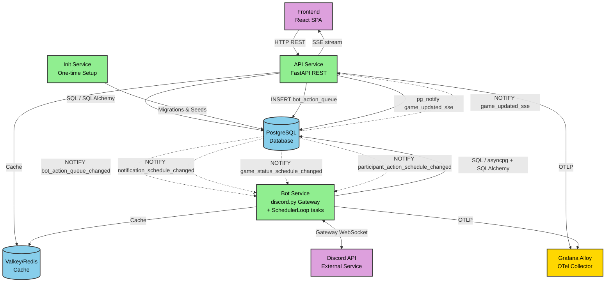
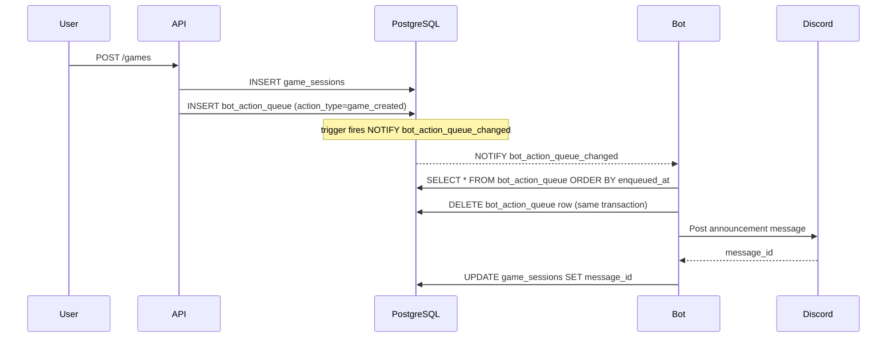
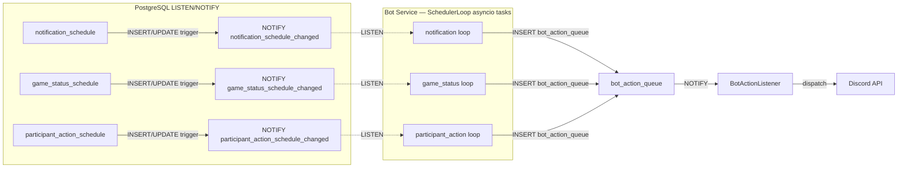

# System Architecture

This document describes the microservices architecture of the Game Scheduler system, including service communication patterns, event flows, and database-driven scheduling.

## Overview

Game Scheduler uses a microservices architecture with all inter-service communication handled through PostgreSQL — no external message broker. The API and bot communicate via a `bot_action_queue` database table; scheduling runs as asyncio tasks inside the bot; and real-time frontend updates flow through PostgreSQL LISTEN/NOTIFY.

### Core Services

- **API Service** - FastAPI REST API for web dashboard and game management
- **Bot Service** - Discord.py Gateway client handling Discord interactions, notifications, and scheduling
- **Init Service** - One-time database migrations and seed data

### Infrastructure

- **PostgreSQL** - Primary data store with Row-Level Security for multi-tenant isolation, and LISTEN/NOTIFY for all event signalling
- **Valkey (Redis)** - Caching layer and session storage

### Supporting Services

- **Grafana Alloy** - OpenTelemetry collector forwarding traces, metrics, and logs to Grafana Cloud
- **Cloudflare Tunnel** - Production reverse proxy (no exposed ports)
- **Backup** - Scheduled database backups to S3

### External Services

- **Discord API** - Discord Gateway WebSocket and REST API
- **Frontend** - React SPA web dashboard

## System Architecture Diagram


```mermaid
graph TB
    %% External
    Discord[Discord API<br/>External Service]
    Frontend[Frontend<br/>React SPA]

    %% Core Services
    API[API Service<br/>FastAPI REST]
    Bot[Bot Service<br/>discord.py Gateway<br/>+ SchedulerLoop tasks]
    Init[Init Service<br/>One-time Setup]

    %% Infrastructure
    PG[(PostgreSQL<br/>Database)]
    Redis[(Valkey/Redis<br/>Cache)]

    %% Supporting
    Alloy[Grafana Alloy<br/>OTel Collector]

    %% DB access
    API -->|SQL / SQLAlchemy| PG
    Bot -->|SQL / asyncpg + SQLAlchemy| PG
    Init -->|Migrations & Seeds| PG
    API -->|Cache| Redis
    Bot -->|Cache| Redis

    %% API → Bot via queue
    API -->|INSERT bot_action_queue| PG
    PG -.->|NOTIFY bot_action_queue_changed| Bot

    %% Scheduling inside bot
    PG -.->|NOTIFY notification_schedule_changed| Bot
    PG -.->|NOTIFY game_status_schedule_changed| Bot
    PG -.->|NOTIFY participant_action_schedule_changed| Bot

    %% SSE
    API -->|pg_notify game_updated_sse| PG
    PG -.->|NOTIFY game_updated_sse| API
    API -->|SSE stream| Frontend

    %% Discord
    Bot <-->|Gateway WebSocket| Discord
    Frontend -->|HTTP REST| API

    %% Observability
    API -->|OTLP| Alloy
    Bot -->|OTLP| Alloy

    classDef service fill:#90EE90,stroke:#333,stroke-width:2px,color:#000
    classDef infrastructure fill:#87CEEB,stroke:#333,stroke-width:2px,color:#000
    classDef external fill:#DDA0DD,stroke:#333,stroke-width:2px,color:#000
    classDef supporting fill:#FFD700,stroke:#333,stroke-width:2px,color:#000

    class API,Bot,Init service
    class PG,Redis infrastructure
    class Discord,Frontend external
    class Alloy supporting
```

## Communication Patterns

The system uses three internal communication patterns, all routed through PostgreSQL.

### 1. API → Bot: BotActionQueue

When API route handlers need the bot to take a Discord action (post a message, send a DM, etc.), they insert a row into the `bot_action_queue` table. A PostgreSQL trigger fires `NOTIFY bot_action_queue_changed` on each insert.

**Flow:**


```mermaid
sequenceDiagram
    participant User
    participant API
    participant DB as PostgreSQL
    participant Bot
    participant Discord

    User->>API: POST /games
    API->>DB: INSERT game_sessions
    API->>DB: INSERT bot_action_queue (action_type=game_created)
    Note over DB: trigger fires NOTIFY bot_action_queue_changed
    DB-->>Bot: NOTIFY bot_action_queue_changed
    Bot->>DB: SELECT * FROM bot_action_queue ORDER BY enqueued_at
    Bot->>DB: DELETE bot_action_queue row (same transaction)
    Bot->>Discord: Post announcement message
    Discord-->>Bot: message_id
    Bot->>DB: UPDATE game_sessions SET message_id
```

**Key properties:**

- The queue insert happens in the same transaction as the game data write — no race conditions
- Each row is deleted within the same transaction as its dispatch; a bot restart simply re-drains any rows that were not yet committed as deleted
- Dispatch failures are logged and the row is still deleted (no infinite retry loops)
- `BotActionListener` holds a persistent asyncpg connection and also drains the queue on startup to catch any rows written before it connected

**Action types:**

| `action_type`       | Trigger                       | Bot action                                                |
| ------------------- | ----------------------------- | --------------------------------------------------------- |
| `game_created`      | POST /games                   | Post announcement to Discord channel                      |
| `game_cancelled`    | Game cancelled via API        | Update/delete Discord message                             |
| `player_removed`    | Player removed by host        | Send DM + edit Discord message                            |
| `send_dm`           | Waitlist promotion detected   | Send promotion notification DM                            |
| Scheduler-generated | Schedule item due (see below) | Send reminder DM / status transition / participant action |

### 2. Scheduling: SchedulerLoop Tasks Inside the Bot

There is no separate scheduler microservice. Three `SchedulerLoop` asyncio tasks start inside the bot process during `on_ready`. Each loop watches one schedule table via PostgreSQL LISTEN/NOTIFY and writes to `bot_action_queue` when an item comes due.


```mermaid
graph LR
    subgraph "PostgreSQL LISTEN/NOTIFY"
        NS[notification_schedule]
        GS[game_status_schedule]
        PA[participant_action_schedule]

        NS -->|INSERT/UPDATE trigger| N1[NOTIFY notification_schedule_changed]
        GS -->|INSERT/UPDATE trigger| N2[NOTIFY game_status_schedule_changed]
        PA -->|INSERT/UPDATE trigger| N3[NOTIFY participant_action_schedule_changed]
    end

    subgraph "Bot Service — SchedulerLoop asyncio tasks"
        L1[notification loop]
        L2[game_status loop]
        L3[participant_action loop]

        N1 -.->|LISTEN| L1
        N2 -.->|LISTEN| L2
        N3 -.->|LISTEN| L3
    end

    L1 -->|INSERT bot_action_queue| BAQ[bot_action_queue]
    L2 -->|INSERT bot_action_queue| BAQ
    L3 -->|INSERT bot_action_queue| BAQ
    BAQ -->|NOTIFY| BAL[BotActionListener]
    BAL -->|dispatch| Discord[Discord API]
```

**Scheduling loop behavior:**

- On NOTIFY (or startup), the loop queries `MIN(time_field) WHERE processed = false`
- If the next item is due, it writes a `bot_action_queue` row and marks the item processed in a single transaction
- Otherwise it sleeps until that item's time, waking immediately if another NOTIFY arrives
- Maximum sleep cap of 900 seconds prevents starvation if NOTIFY is missed

**Key properties (unchanged from the prior standalone daemon):**

- All state persisted in database — restarts simply re-query for the next due item
- Partial indexes on `(time_field) WHERE processed = false` keep the MIN() query O(1)
- Sub-10 second latency for schedule changes (NOTIFY wakes the loop immediately)

### 3. SSE: Real-time Frontend Updates

The API pushes game state changes to connected frontend clients via Server-Sent Events. The same PostgreSQL LISTEN/NOTIFY mechanism is used to fan out updates within the API process.

```
API route handler
  → writes game update to DB
  → calls pg_notify('game_updated_sse', json_payload)

SSEGameUpdateBridge (asyncpg connection in API process)
  ← NOTIFY game_updated_sse
  → broadcasts payload to all authorized SSE client connections
     (filtered by guild membership server-side)
```

## Service Responsibilities

### API Service

**Primary responsibilities:**

- REST API for web dashboard
- OAuth2 authentication with Discord
- Game CRUD operations and participant management
- Authorization checks (guild membership, host permissions)
- Inserting `bot_action_queue` rows for bot actions
- Calling `pg_notify('game_updated_sse', ...)` for real-time frontend updates

**Database access:**

- CRUD operations through SQLAlchemy ORM
- Transaction management in service layer
- Row-Level Security enforced via `SET LOCAL rls.guild_id`

### Bot Service

**Primary responsibilities:**

- Discord Gateway connection (WebSocket)
- Button interaction handling (join/leave game)
- Sending Discord messages (announcements, DMs)
- Draining `bot_action_queue` via `BotActionListener`
- Running `SchedulerLoop` asyncio tasks for notifications, status transitions, and participant actions

**Database access:**

- Reads game/participant data via SQLAlchemy sessions
- Writes via `BotActionQueue` model and schedule status updates
- Uses a dedicated `gamebot_bot` database user with appropriate permissions

## Security Architecture

### Row-Level Security (RLS)

The system uses PostgreSQL Row-Level Security for multi-tenant guild isolation:

**Per-request guild context:**

```sql
SET LOCAL rls.guild_id = '<discord_guild_id>';
```

RLS policies automatically filter all queries to the current guild, preventing cross-guild data access. This is enforced at the database level regardless of application-level authorization.

**Special users:**

- `gamebot_app` — API service; RLS enforced
- `gamebot_bot` — Bot service; has permissions for cross-guild schedule reads
- `gamebot_admin` — Init service and migrations; bypasses RLS

See [production-readiness.md](production-readiness.md) for RLS policy details.

### API Authorization

Three-level authorization on every protected endpoint:

1. **Authentication** — Discord OAuth2 validates user identity
2. **Guild membership** — User must be a member of the guild being accessed
3. **Role-based access** — Host permissions checked for game management operations

## Monitoring and Observability

All services are instrumented with OpenTelemetry via `shared/telemetry.py`:

- **Traces** — Distributed tracing across API and bot requests
- **Metrics** — Request rates, latencies, database query performance
- **Logs** — Structured JSON logs with trace ID correlation

Grafana Alloy collects OTLP telemetry from all services and also scrapes PostgreSQL and Redis infrastructure metrics, forwarding everything to Grafana Cloud.

## Related Documentation

- [Database Schema](database.md) - Entity-relationship diagrams and RLS policies
- [OAuth Flow](oauth-flow.md) - Discord authentication sequence
- [Transaction Management](transaction-management.md) - Service layer patterns
- [Production Readiness](production-readiness.md) - Multi-tenant security with RLS
- [Public Image Architecture](public-image-architecture.md) - Image serving and deduplication
- [Docker Compose Dependencies](compose-dependencies.md) - Service startup orchestration
- [Testing Guide](TESTING.md) - Integration and E2E test coverage
