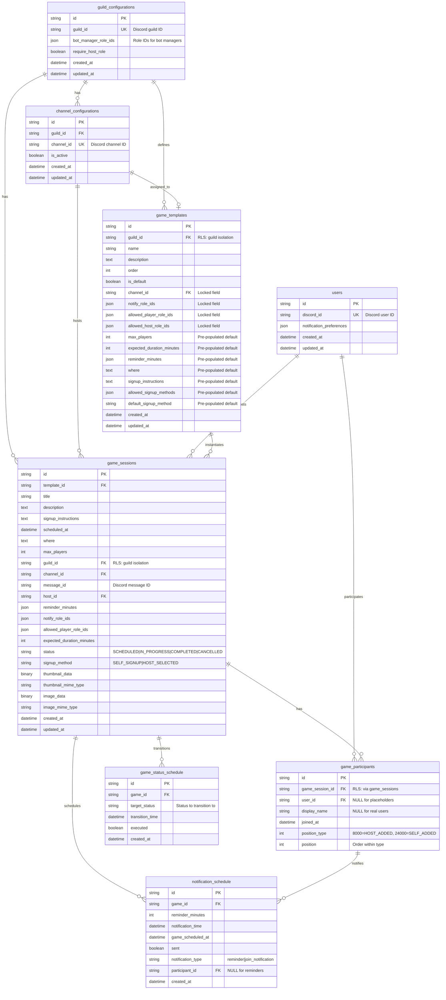

# Database Schema

This document provides an entity relationship diagram (ERD) of the game scheduler database schema.

## Row-Level Security (RLS)

The following tables have Row-Level Security enabled for guild isolation:
- **game_sessions** - Isolates games by guild_id
- **game_templates** - Isolates templates by guild_id
- **game_participants** - Isolates participants via game_sessions join

RLS policies use the `app.current_guild_ids` session variable to filter rows accessible to the current request. This ensures complete guild isolation at the database layer.

## Entity Relationship Diagram

## Key Relationships

### Guild Hierarchy
- **Guilds** (Discord servers) contain channels, templates, and games
- Each guild can have multiple channels configured for game scheduling
- Templates are guild-specific and define game types

### Template System
- Templates define game types (e.g., "D&D Campaign", "Board Game Night")
- **Locked fields**: Set by bot managers, cannot be changed by hosts (channel, role restrictions)
- **Pre-populated fields**: Provide defaults that hosts can override (max players, duration, etc.)

### Game Sessions
- Core entity representing a scheduled game
- Each game is associated with a template (or custom if template_id is NULL)
- Games belong to a guild, are posted in a channel, and are hosted by a user
- Support both self-signup and host-selected participant management

### Participant Management
- Supports two types of participants:
  - **Real users**: `user_id` set, `display_name` NULL (fetched dynamically from Discord)
  - **Placeholders**: `user_id` NULL, `display_name` set (host-entered names)
- Position tracking with two-tier system (type + position within type)

### Notification System
- Database-backed reminders calculated when game is created/updated
- Two notification types:
  - **reminder**: Game-wide notifications sent to all participants
  - **join_notification**: Individual participant join confirmations
- Daemon uses PostgreSQL LISTEN/NOTIFY for efficient event-driven processing

### Status Transitions
- Automated status changes managed by daemon
- Transitions: SCHEDULED → IN_PROGRESS → COMPLETED
- Games can also be manually marked as CANCELLED
