# OAuth Authentication Flow

This document describes the OAuth2 authentication flow used in the Discord Game Scheduler application.

## Flow Diagram

```mermaid
sequenceDiagram
    actor User
    participant Frontend as Frontend<br/>(localhost:3000)
    participant API as API Server<br/>(/api/v1/auth)
    participant Discord as Discord OAuth

    User->>Frontend: Visit /login
    Frontend->>Frontend: Generate REDIRECT_URI<br/>(window.location.origin/auth/callback)

    User->>Frontend: Click "Login with Discord"
    Frontend->>API: GET /api/v1/auth/login<br/>?redirect_uri=http://localhost:3000/auth/callback
    API->>API: Generate state token
    API->>API: Store state → redirect_uri in Redis<br/>(TTL: 10 minutes)
    API->>Frontend: Return authorization_url & state
    Frontend->>Frontend: Store state in sessionStorage
    Frontend->>User: Redirect to Discord OAuth URL

    User->>Discord: Authorize application
    Discord->>Frontend: Redirect to /auth/callback<br/>?code=XXX&state=YYY

    Frontend->>Frontend: Retrieve stored state<br/>from sessionStorage
    Frontend->>API: GET /api/v1/auth/callback<br/>?code=XXX&state=YYY<br/>(credentials: include)

    API->>API: Validate state token<br/>(retrieve & delete from Redis)
    API->>Discord: POST /oauth2/token<br/>(exchange code for tokens)
    Discord->>API: Return access_token,<br/>refresh_token, expires_in

    API->>Discord: GET /users/@me<br/>(using access_token)
    Discord->>API: Return user data (discord_id, etc)

    API->>API: Find or create User<br/>in database
    API->>API: Store tokens in Redis<br/>(with session_token key)
    API->>Frontend: Set session_token cookie<br/>(httponly, secure, samesite=lax)
    API->>Frontend: Return {success: true}

    Frontend->>API: GET /api/v1/auth/me<br/>(with session_token cookie)
    API->>Frontend: Return user info
    Frontend->>User: Navigate to home page<br/>(authenticated)
```

## Key Components

### Frontend (`LoginPage.tsx`)
- Initiates the OAuth flow
- Sets redirect URI to `${window.location.origin}/auth/callback`
- Stores state token in sessionStorage for CSRF validation

### Frontend (`AuthCallback.tsx`)
- Receives the OAuth redirect from Discord
- Proxies the authorization code and state to the API backend
- Completes login and redirects to home page

### API (`/api/v1/auth/login`)
- Generates Discord OAuth authorization URL
- Creates and stores state token in Redis (10-minute TTL)
- Returns authorization URL and state to frontend

### API (`/api/v1/auth/callback`)
- Validates state token (CSRF protection)
- Exchanges authorization code for access/refresh tokens
- Fetches user information from Discord
- Creates or updates user in database
- Stores tokens in Redis with session token
- Sets httponly session cookie

## Security Features

1. **CSRF Protection**: State token validated on callback
2. **Secure Storage**: Tokens stored in Redis, not exposed to frontend
3. **HttpOnly Cookies**: Session token not accessible via JavaScript
4. **Token Expiration**: State tokens expire after 10 minutes
5. **SameSite Cookie Policy**: Prevents CSRF attacks

## Important Notes

- **Discord redirects to the frontend**, not the API server
- The frontend acts as a proxy, forwarding credentials to the API
- This design gives the frontend control over routing and UX after authentication
- Session tokens are valid for 24 hours (86400 seconds)
